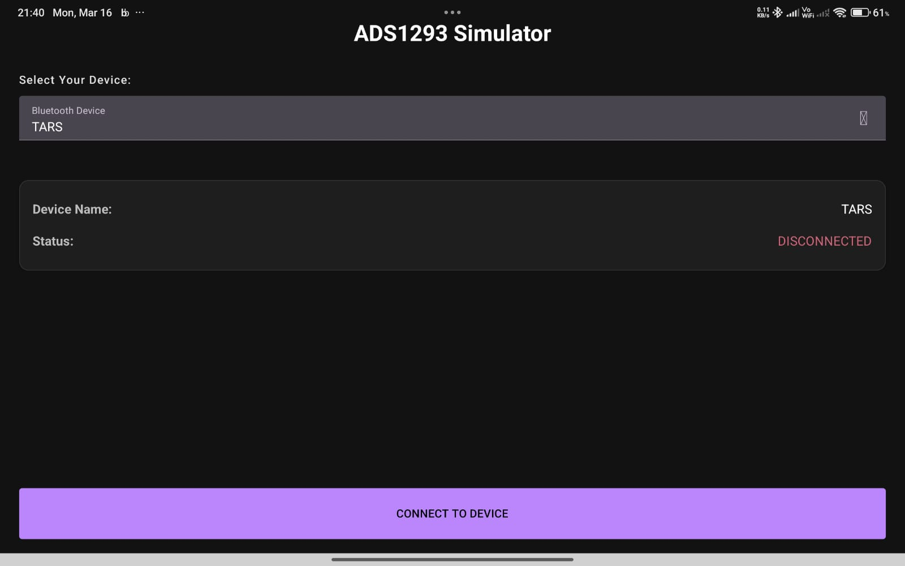

# ADS 1293 Simulator App

The application mimics how NID-24's custom ADS1293 based board will transmit
data over bluetooth. This app let's user test the system without wating for hardware.

Please note that you MUST enable bluetooth before running the app.
Allow, bluetooth permissions

Ensure that your host machine is listening for connections. Otherwise, app will show FAILED TO CONNECT

Once you press CONNECT TO DEVICE, it will immediately start streaming data at a rate of 1kHz.